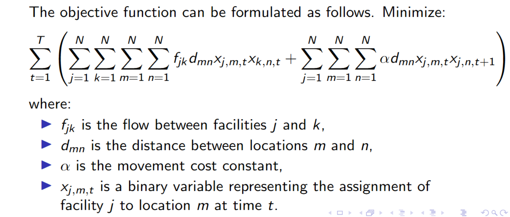
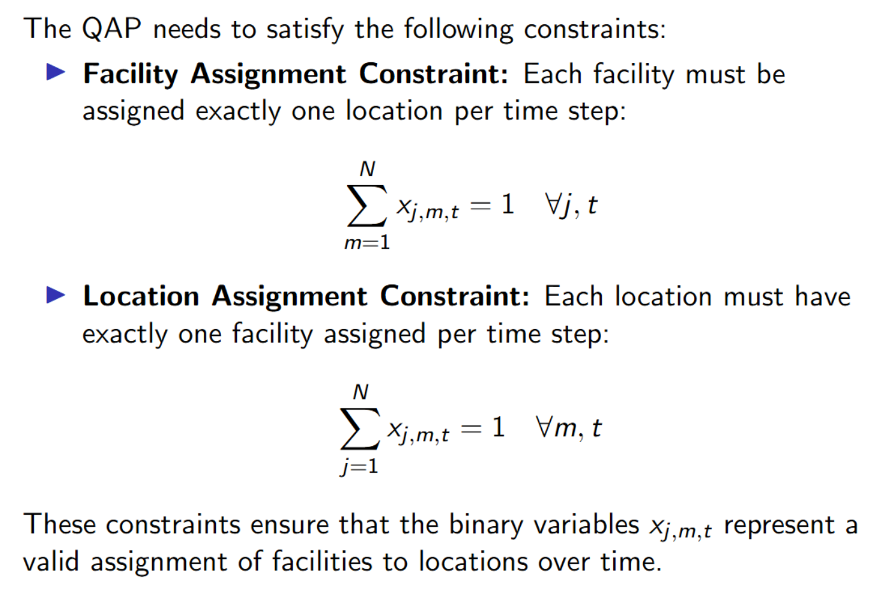
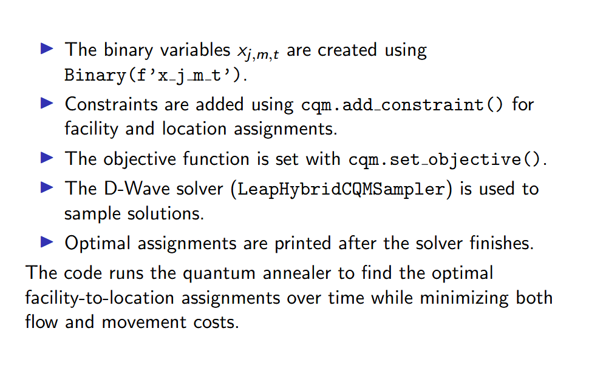
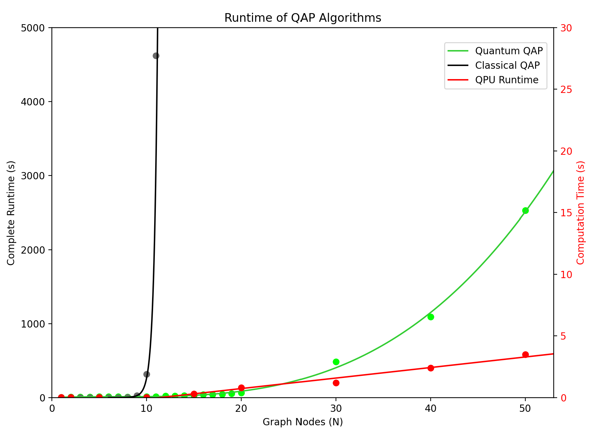
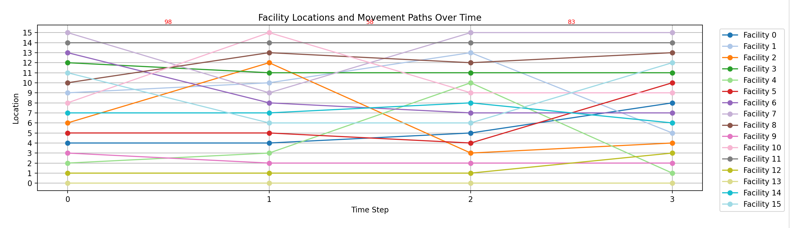
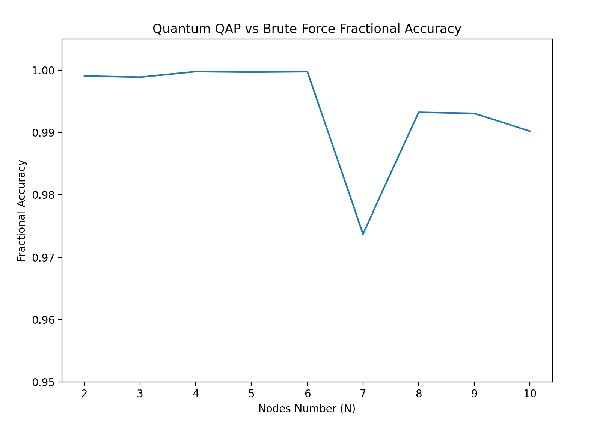

# Time-Dependent Quadratic Assignment Problem (TD-QAP) - iQuHACK 2025, First Place Winner for D-Wave Challenge

Given NxN flow and distance matrices with time dependence, we implement two algorithms to solve the time-dependent quadratic alignment problem:
1. A classical computing, brute-force approach: Perfect accuracy is guaranteed but will only reliably finish for N <= 12. To show how quickly it scales, our data predicts the algorithm will take 70 minutes for N = 11, and the age of the universe for N = 21.
2. A quantum computing approach using D-Wave Systems' Quantum Annealers: Almost perfect accuracy (~99%) for tested N up to N = 50. Provides sufficient accuracy and precision with minimal quantum fluctuations in a fraction of the time (~65s for N = 20, ~42m for N = 50). Most of this time is spent calculating the costs (as we are using D-Wave's hybrid computers) and the QPU usage is kept under 3 seconds even when N = 50.

Our approach relies on converting QAP into a quadratic unconstrained binary optimization problem that can be modeled by the Ising Model. This ensures scalability if we wish to transition to fully quantum hardware. We compute the objective function by summing the costs and using it as our Hamiltonian energy function, which the quantum computer should minimize.

 
&nbsp&nbsp&nbsp&nbsp&nbsp&nbsp&nbsp&nbsp
  
  

Some runtime analysis of how the classical vs quantum algorithms scale for this problem, as well as how much time is spent in the actual quantum processing unit (QPU) is shown below.

Example data mapping the TD-QAP problem to the seasonal allocation of flight/air train/bus allocation in airports based on popular destinations:

The quantum algorithm has been shown to work with >99% accuracy for values of N < 10 when compared to the brute force algorithm, and its costs remain reasonable as N scales up. In the graph below, 1.00 is the accuracy of the brute force algorithm.

We can see some fluctuations due to random errors, but the effect on the accuracy is negligible. Furthermore, if we wanted to improve these results, we could run for a given N a number of times and average out the errors. Thus, we can make comparisons with various slightly inaccurate classical heuristics, but since quantum computing still has a long way to go and this result was achieved with the number of qubits only in the hundreds, the technology is extremely promising.
